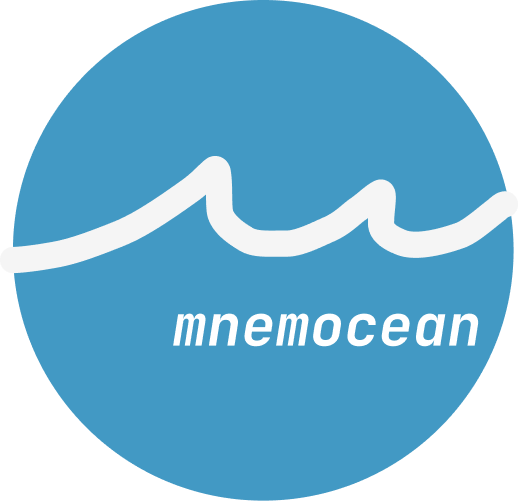

<p align="center">
    
</p>

[](https://github.com/kamchatka-volcano/mnemocean/actions/workflows/build_and_test.yml)

**mnemocean** is a mnemonic id generator library for C++17 that allows you to create human-readable identifiers like
`working-alpaca` or `plain-water-94774` using standard library random number generators.

### Usage

`mnemocean` includes two identificator formats:

* `heroku` (adjective-noun) the dictionary is taken from [haikunatorjs](https://github.com/Atrox/haikunatorjs)
  ```cpp
  #include <mnemocean/mnemocean.h>
  
  auto randomNumberGenerator = std::mt19937{std::random_device{}()};
  auto generator = mnemocean::heroku_id_generator<std::mt19937>{randomNumberGenerator};
  std::cout << generator(); // => "plain-water"
  ```
* `petname` (adverb-adjective-animal or adjective-animal)  the dictionary is taken
  from [python-petname](https://github.com/dustinkirkland/python-petname)
  ```cpp
  #include <mnemocean/mnemocean.h>
  
  auto randomNumberGenerator = std::mt19937{std::random_device{}()}; 
  auto generator =
            mnemocean::petname_id_generator<std::mt19937>{randomNumberGenerator};
  std::cout << generator(); // => "working-alpace"
  ///
  auto longGenerator =
            mnemocean::petname_id_generator<std::mt19937, mnemocean::petname_format::long_name>{randomNumberGenerator};
  std::cout << longGenerator(); // => "recently-working-alpaca"
   
  ```

You can also use the `mnemocean::mnemonic_id_generator` class template to create your own id generator with custom
dictionaries:

```cpp
#include <mnemocean/mnemocean.h>

auto randomNumberGenerator = std::mt19937{std::random_device{}()};
const auto fullDictionary =
        mnemocean::dictionary{{"foo", "bar", "baz"}, {"red", "green", "blue"}, {"quickly", "slowly", "happily"}};
auto fullGenerator = mnemocean::mnemonic_id_generator<std::mt19937>{randomNumberGenerator, fullDictionary};
std::cout << fullGenerator(); // => "quickly-green-foo"

const auto nounAjectiveDictionary = mnemocean::dictionary{{"foo", "bar", "baz"}, {"red", "green", "blue"}};
auto nounAjectiveGenerator =
        mnemocean::mnemonic_id_generator<std::mt19937>{randomNumberGenerator, nounAjectiveDictionary};
std::cout << nounAjectiveGenerator(); // => "red-baz"

const auto nounDictionary = mnemocean::dictionary{{"foo", "bar", "baz"}};
auto nounGenerator = mnemocean::mnemonic_id_generator<std::mt19937>{randomNumberGenerator, nounAjectiveDictionary};
std::cout << nounGenerator(); // => "foo"
```

Any format can be used with an additional token that can help to avoid collisions in the identifiers. Alphabetic,
alphanumeric and numeric token generators are provided out of the box:

```cpp
#include <mnemocean/mnemocean.h>

auto randomNumberGenerator = std::mt19937{std::random_device{}()};
{
    auto generator = mnemocean::heroku_id_generator<std::mt19937>{
            randomNumberGenerator,
            mnemocean::alphabetic_token_generator{}};
    std::cout << generator(); // => "young-hill-syadh"
}
{
    // You can also specify the length of the token
    auto generator = mnemocean::heroku_id_generator<std::mt19937>{
            randomNumberGenerator,
            mnemocean::alphabetic_token_generator<3>{}};
    std::cout << generator(); // => "young-hill-sya"
}
{
    auto generator = mnemocean::heroku_id_generator<std::mt19937>{
            randomNumberGenerator,
            mnemocean::alphanumeric_token_generator{}};
    std::cout << generator(); // => "young-hill-94774"
}
{
    auto generator = mnemocean::heroku_id_generator<std::mt19937>{
            randomNumberGenerator,
            mnemocean::number_token_generator{}};
    std::cout << generator(); //=> "dark-lab-2592"
}
{
    // You can use zero-padded format for numeric tokens
    auto generator = mnemocean::heroku_id_generator<std::mt19937>{
            randomNumberGenerator,
            mnemocean::number_token_generator<5, mnemocean::number_string_format::zero_padded_decimal>{}};
    std::cout << generator(); //=> "dark-lab-02592"
}
{
    // You can use hexadecimal numbers as a token
    auto generator = mnemocean::heroku_id_generator<std::mt19937>{
            randomNumberGenerator,
            mnemocean::number_token_generator<5, mnemocean::number_string_format::hexadecimal>{}};
    std::cout << generator(); //=> "dark-lab-6a31"
}
{
    // You can use zero-padded format with hexadecimal numbers
    auto generator = mnemocean::heroku_id_generator<std::mt19937>{
            randomNumberGenerator,
            mnemocean::number_token_generator<5, mnemocean::number_string_format::zero_padded_hexadecimal>{}};
    std::cout << generator(); //=> "dark-lab-06a31"
}
```

Custom token generators can be created by providing a callable object with the following signature

```cpp
template<typename UniformRandomNumberGenerator>
std::string operator()(std::string_view id, UniformRandomNumberGenerator&)
```

It can be used to eliminate collisions in the identifiers by storing the generated identifiers and using a counter for a
token:

```cpp
#include <mnemocean/mnemocean.h>

class ConflictResolverTokenGenerator
{
public:
    ConflictResolverTokenGenerator(std::unordered_map<std::string, int>& generatedTokens)
        : generatedTokens_(&generatedTokens)
    {
    }

    template<typename UniformRandomNumberGenerator>
    std::string operator()(std::string_view id, UniformRandomNumberGenerator&) const
    {
        auto tokenIt = generatedTokens_->find(std::string{id});
        if (tokenIt != generatedTokens_->end()){
            tokenIt->second++;
            return std::to_string(tokenIt->second);
        }
        (*generatedTokens_)[std::string{id}] = 1;
        return "1";
    }

private:
    std::unordered_map<std::string, int>* generatedTokens_{};
};

auto generatedTokens = std::unordered_map<std::string, int>{};
auto conflictResolver = ConflictResolverTokenGenerator{generatedTokens};
auto randomNumberGenerator = std::mt19937{std::random_device{}()};

// A dictionary which always creates the same identifiers
const auto exhaustedDictionary = mnemocean::dictionary{{"foo"}, {"green"}, {}};
auto generator = mnemocean::mnemonic_id_generator<std::mt19937>{
        randomNumberGenerator, exhaustedDictionary, conflictResolver};
        
std::cout << generator(); //=> "green-foo-1";
std::cout << generator(); //=> "green-foo-2";
```

Note that the `mnemocean` uses `std::uniform_int_distribution` internally, which is not guaranteed to produce the same
results from the same seed across different compilers or even different versions of the same compiler.
If you need to ensure that the generated identifiers are consistent across different platforms, the implementation can
be switched to use boost's random number generator by enabling `MNEMOCEAN_USE_BOOST_RANDOM` CMake option.

```cpp

### Installation

Download and link the library from your project's CMakeLists.txt:

```
cmake_minimum_required(VERSION 3.18)

include(FetchContent)

FetchContent_Declare(mnemocean
    URL https://github.com/kamchatka-volcano/mnemocean/releases/download/v0.1.0/mnemocean-v0.1.0.zip    
)

#uncomment if you need to install mnemocean with your target
#set(INSTALL_MNEMOCEAN ON)
FetchContent_MakeAvailable(mnemocean)

add_executable(${PROJECT_NAME})
target_link_libraries(${PROJECT_NAME} PRIVATE mnemocean::mnemocean)
```

Prefer using the release ZIP archive with FetchContent, as it is fully self-contained and avoids spending additional
time downloading the library dependencies during the CMake configuration step.

To install the library system-wide, use the following commands:

```
git clone https://github.com/kamchatka-volcano/mnemocean.git
cd mnemocean
cmake -S . -B build
cmake --build build
cmake --install build
```

After installation, you can use the `find_package()` command to make the installed library available inside your
project:

```
find_package(mnemocean 0.1.0 REQUIRED)
target_link_libraries(${PROJECT_NAME} PRIVATE mnemocean::mnemocean)
```

### Running tests

```
cd mnemocean
cmake -S . -B build -DENABLE_TESTS=ON
cmake --build build
cd build/tests && ctest
```

### License

**mnemocean** is licensed under the [MS-PL license](/LICENSE.md)  
